# 先序、中序、后序

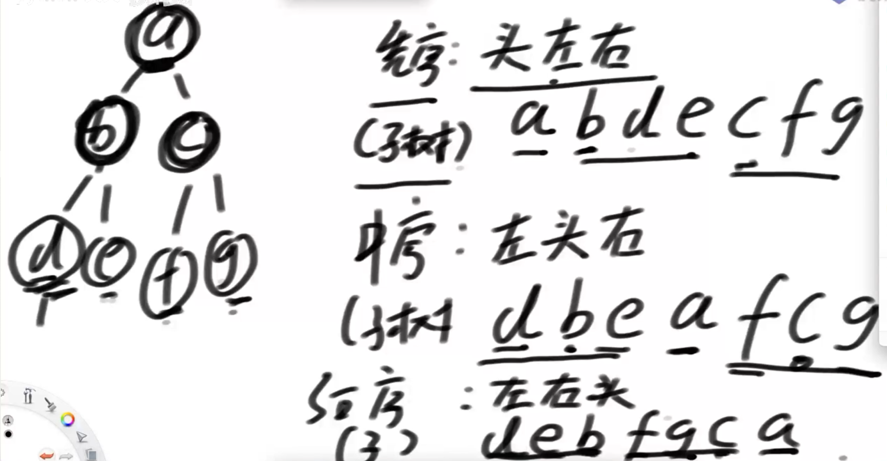

## 递归

递归序变成先序、中序、后序

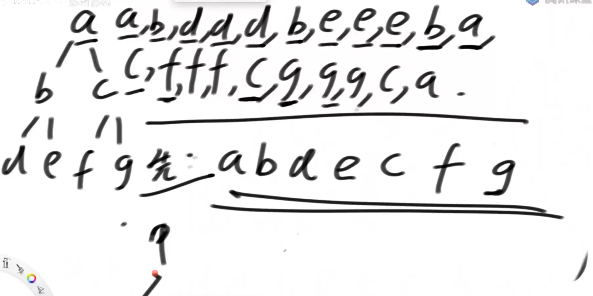

每一个节点都会访问三次

先序：访问三次里的第一次。中序：访问三次里的第二次。后序：访问三次里的第三次。

```java
	public static void f(Node head) {
		if (head == null) {
			return;
		}
		// 1
		f(head.left);
		// 2
		f(head.right);
		// 3
	}
```

​	

## 节点的规律

把树节点分类

### 1.所有父节点

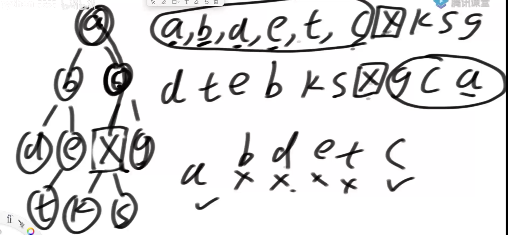

一个二叉树，已知一个节点x，得到他的所有父节点。

用先序和后序，排出节点顺序。先序排序中x前面节点集合(a,c,d,e,t,c)，后序排序中x后面节点集合(g,c,a)，两个集合相同的节点就是x的父节点（a,c）

### 2.x左树姿态下的右兄，x右树姿态下的左兄。

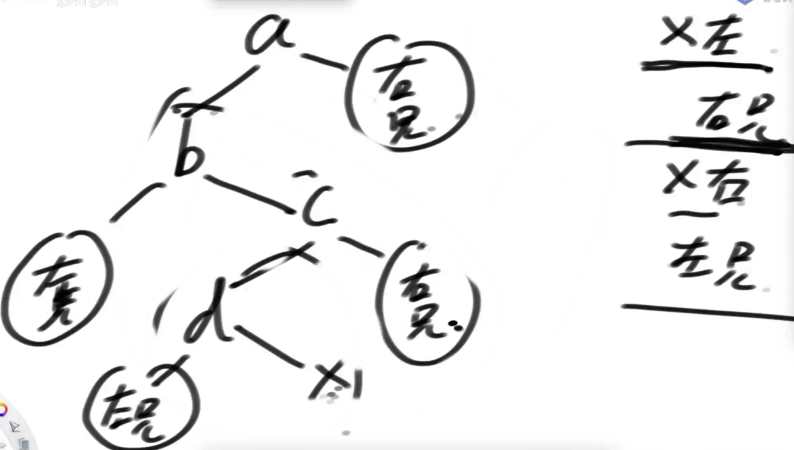

在先序遍历中，x左树姿态下的右兄，一定在x右侧；x右树姿态下的左兄，一定在x左侧

## 非递归

### 先序输出

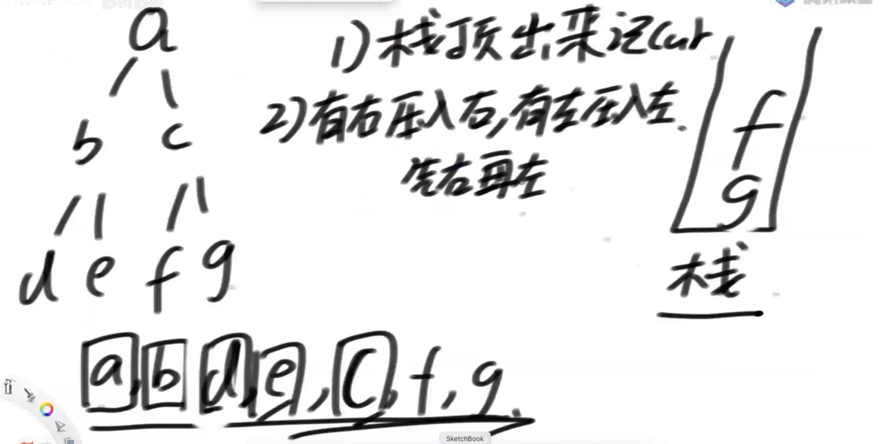

上图是把树以先序非递归的方式输出。

### 后序输出

1.因为压栈的顺序和输出的顺序是相反的，所有想要 ‘头右左’ 的形式输出，那么只要在压栈的时候，先压左再压右即可

2.让树按照 ‘头右左’ 的形式压栈，在弹栈的时候，把节点放到一个新的栈里。遍历完树之后，再让新栈里的节点逐个弹出，因为压入和弹出的顺序是相反的，所以从‘头右左’变成‘左右头’，也就是后序。

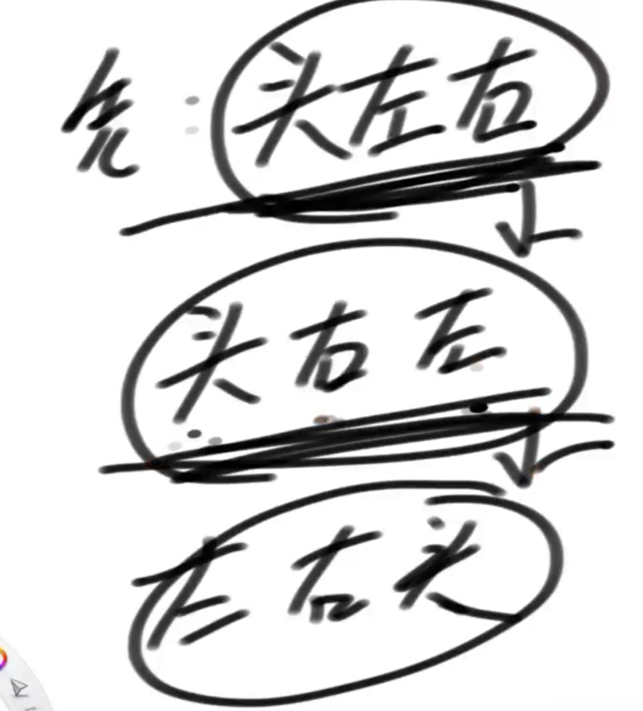

## 可选题，用一个栈实现后序非递归遍历

```java
	public static void pos2(Node h) {
		System.out.print("pos-order: ");
		if (h != null) {
			Stack<Node> stack = new Stack<Node>();
			stack.push(h);
			Node c = null;
			while (!stack.isEmpty()) {
				c = stack.peek();
				if (c.left != null && h != c.left && h != c.right) {
					stack.push(c.left);
				} else if (c.right != null && h != c.right) {
					stack.push(c.right);
				} else {
					System.out.print(stack.pop().value + " ");
					h = c;
				}
			}
		}
		System.out.println();
	}
```


### 中序输出

1.把树的头结点放到cur里，把cur压入栈中，之后cur移到左节点，依次循环，直到遇到空就进入第二步。

2.弹出栈顶并打印，cur移到到栈顶元素的右节点上

3.如果栈和cur都是空，就结束


# 按层遍历

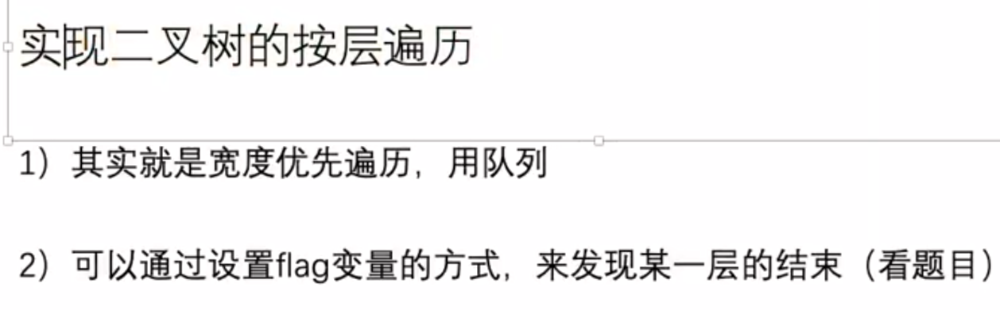

 

## 宽度优先遍历-队列

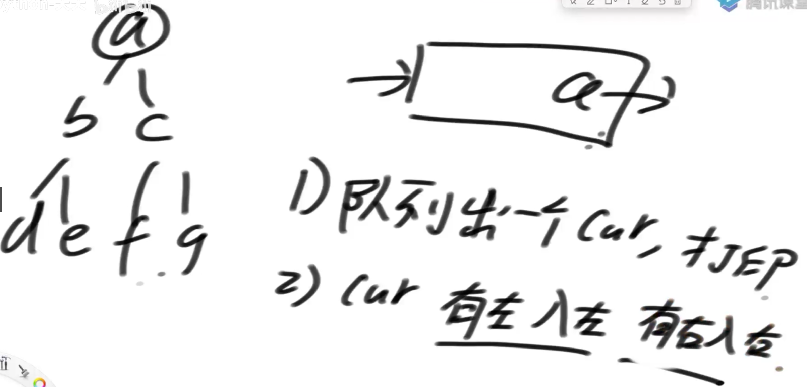

# 序列号和反序列化

用字符串储存类似树，链表这种带有指针的数据结构

## 先序

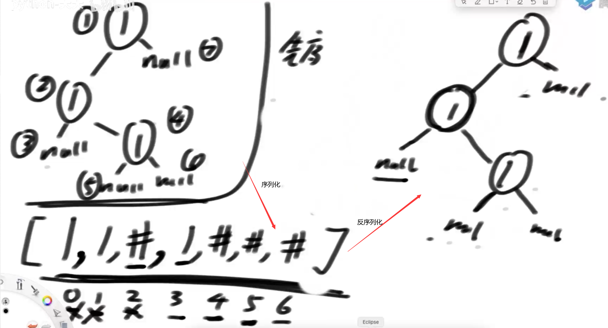

序列化和反序列化：类似先序遍历。


## 中序

没有办法序列化和反序列化，因为有歧义

## 后序

序列化：类似后序遍历

反序列化：把队列的内容放入栈，序列化后的字符串会翻转（左右中  ->  stack(中右左)）。把先序反序列化的代码复制粘贴，把赋值给左树和右树的顺序反向就可以了

## 按层

序列化，反序列化：双队列，非递归


## 题1：把多叉树序列化成二叉树，并且可以反序列化

LeetCode 431. 将 N 叉树编码为二叉树（递归/层序）

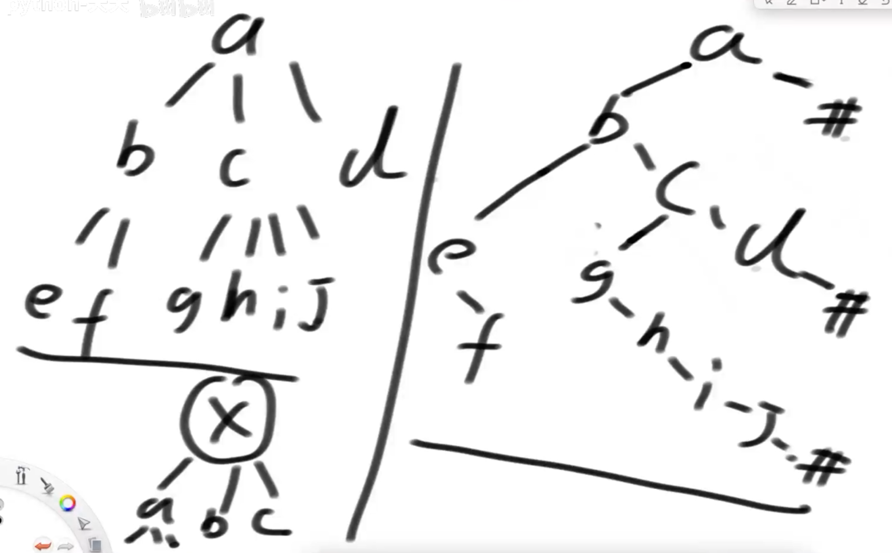

序列化：把多叉树x节点的孩子节点，放在二叉树x节点的左树右孩子上。


## 题2：如何设计一个打印整个树的打印函数（低频题）


## 题3：求二叉树最宽的层有多少个节点


## 题4：给你二叉树中的某个节点，返回该节点的后继节点

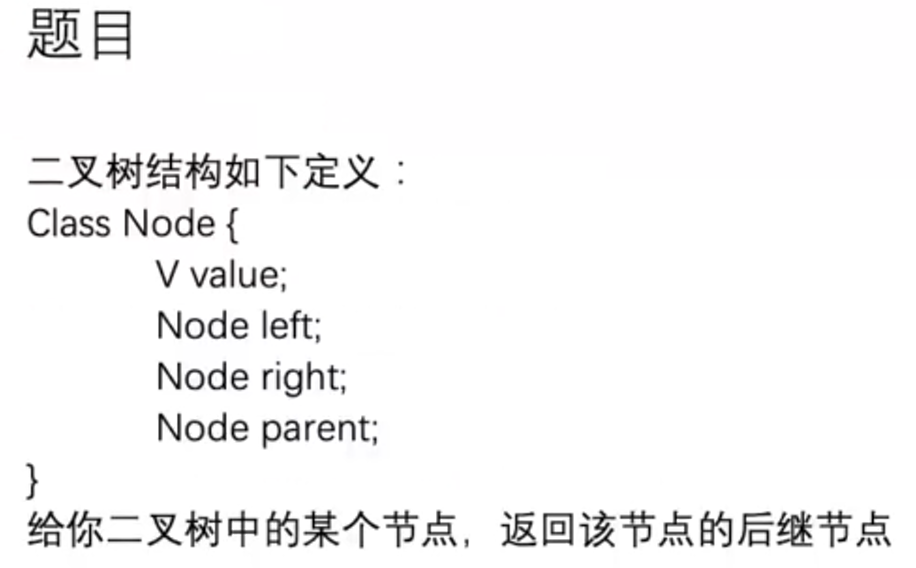

后继节点：在中序遍历里，该节点后一个节点

解法：

1. 如果节点有子树，那么后继节点在右树上的最左子树上
2. 如果节点没有子树，那么向上找，如果该节点是上一个节点的右子树那么继续向上，直到该节点是上一个节点的左子树，这上一个节点就是后继节点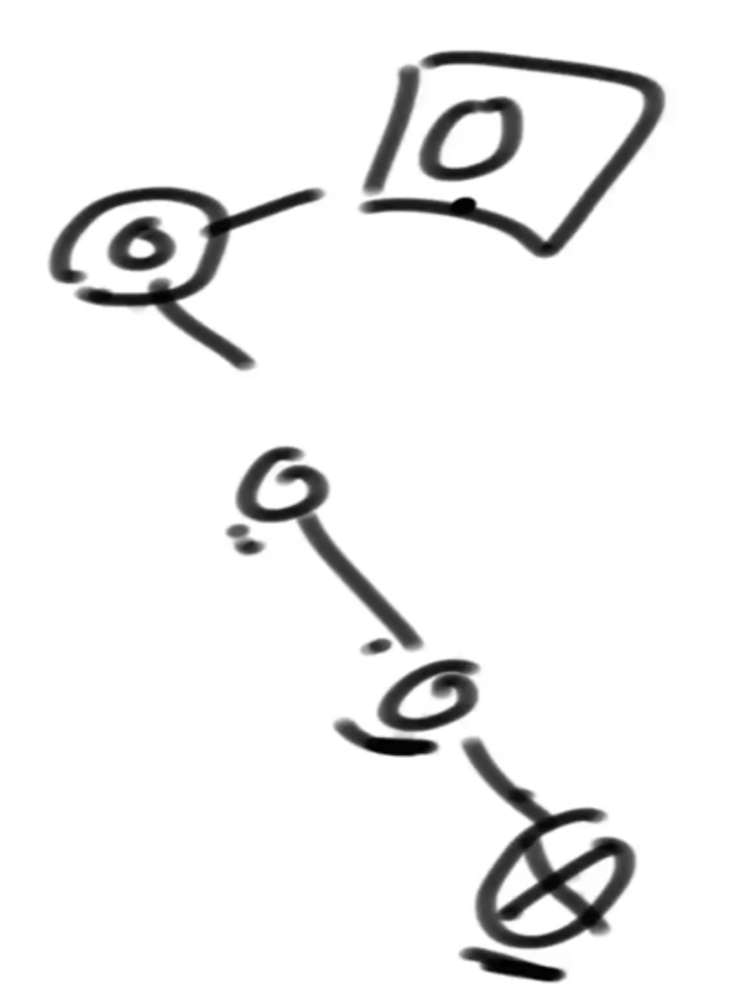
3. 如果节点没有子树，而且上一个节点都是该节点的右树，那么该节点是后继节点就是空

## 题5：折纸问题

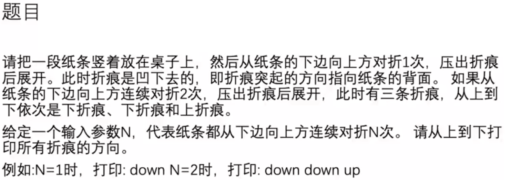

根据题目得出以下结构

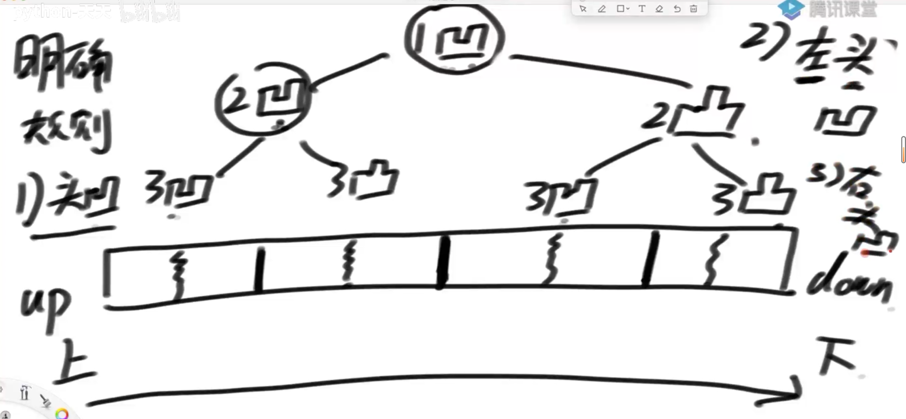

可以看到规律：1.头节点是凹，2.左子树都是凹的，3.右子树都是凸的

实现的代码，不用先构建一个数再打印

## 题6：判断二叉树是否是完全二叉树

二叉树要按层遍历。

1. 如果该节点只有右子树而没有左子树，那一定不是完全二叉树
2. 如果有左右子树就跳过
3. 如果只有左子树或者没有子树，那之后的节点如果出现子树，那一定不是完全二叉树

递归解法在下一章
