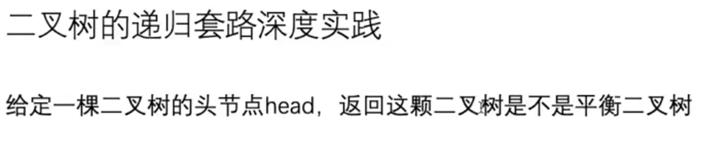
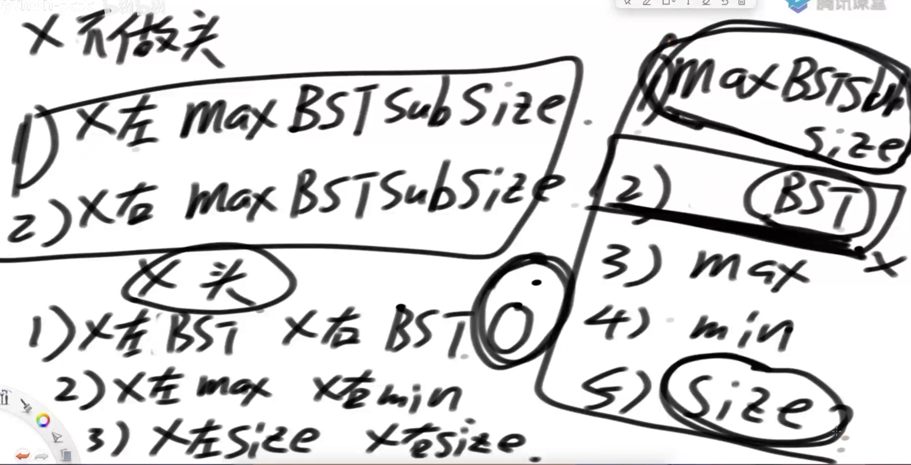
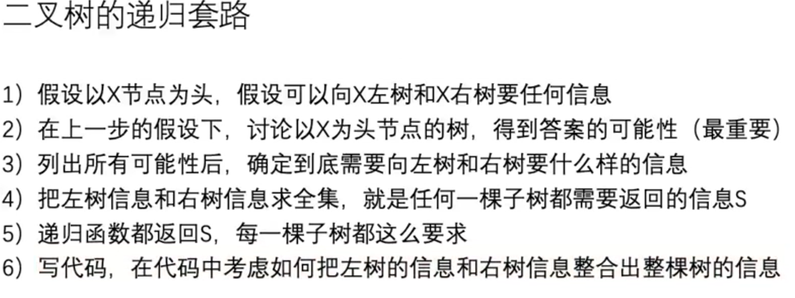

# 二叉树的递归套路深度实践

## 判断二叉树是不是完全二叉树

非递归解法在上一章

以本结点左右情况来判断。

1. 左子树是完全，右子树是满，左高=右高+1，是完全二叉树
2. 左子树是满，右子树是完全，左高=右高，是完全二叉树
3. 左子树是满，右子树是满，左高=右高+1，是完全二叉树
4. 左子树是满，右子树是满，左高=右高，是完全二叉树

只有上面四种情况是完全二叉树，可知返回值是，是否完全、是否满、树高度

## 题1:给一个头结点，判断这个二叉树是不是平衡二叉树

平衡二叉树：二叉树的每一个节点的左右子树的深度差是0或1

## 题2：判断二叉树是否是搜索二叉树

搜索二叉树：每一个左子树结点都比头小，右树都比头大。在经典搜索二叉树里每个节点的值都是唯一的。

如果有相同的节点值，不同的副值，可以在节点结构里准备一个链表，放置其他的值

方法1：中序遍历二叉树，值是依次上升的

方法2：二叉树递归

## 题3：给定一棵二叉树的头节点head，任何两个节点之间都存在距离,返回整棵二叉树的最大距离

距离：从自己到目标经过了多少节点，包括自己节点和目标节点，所以两点之间最短距离只能为2，一个节点是1，空数是0

返回信息是：高度和最大距离

左右数是对称的，才可以一起用递归

1. 左子树最大距离
2. 右子树最大距离
3. 左右子树经过自己节点时的最大距离，也就是左子树的高度+右子树的高度+1

上面三个中最大的，才是该树最大距离

## 题4：判断一个二叉树是不是满二叉树

满二叉树：树的高度h，节点数是2^h-1

返回信息是：高度和节点数

如果返回的信息符合 节点数=2^h-1 那就是满二叉树

## 题5：找到二叉树里最大二叉搜索树

返回最大二叉树的节点数/头节点

# 总结 

时间复杂度都是O(n)，n是节点数

1. 思想性的提醒，有思路去写这道题
   1. 返回值
   2. 根据左右树返回的值做各种可能性分析	
2. 模板化的做题
   1. 一开始的边界条件，不好设置就返回空，好设置就返回具体的对象
   2. 获得左右子树两个返回值（相当于后序遍历）
   3. 对两个返回值，经过各种可能性处理，获得新的值，返回给上一个节点

## 题6：给一个二叉树的头节点，求二叉树里节点a，b的最低公共祖先

解法1 非递归

递归遍历二叉树，把本节点和子节点存入map里，遍历完之后，就可以通过map来找到本节点的父节点。

然后把a，b节点以及父节点，从下往上依次比较，出现最早的就是最低公共祖先

解法2 递归

1. 本节点不是最低公共祖先
   1. ab在左边
   2. ab在右边
   3. 左右都没ab
2. 本节点是最低公共祖先
   1. a和b在
   2. 本节点是a，b在子节点
   3. 本节点是b，a在子节点

# 题7：

多叉树

1. 如果选择一个节点，那该节点的直接父/子节点都不能选
2. 在多叉树里，每一个节点都有值，从多叉树里，求累加和最大的节点组合

递归

设：自己节点是x，对应的子节点是a,b,c...

返回值是 选择x后累加值情况 int yesNum，不选择x后累加值情况int noNum

选择自己的话，x.value+a.noNum+b.noNum ...

不选择自己的话 0+Max(a.yesNum,a.noNum)+Max(a.yesNum,a.noNum) ...

