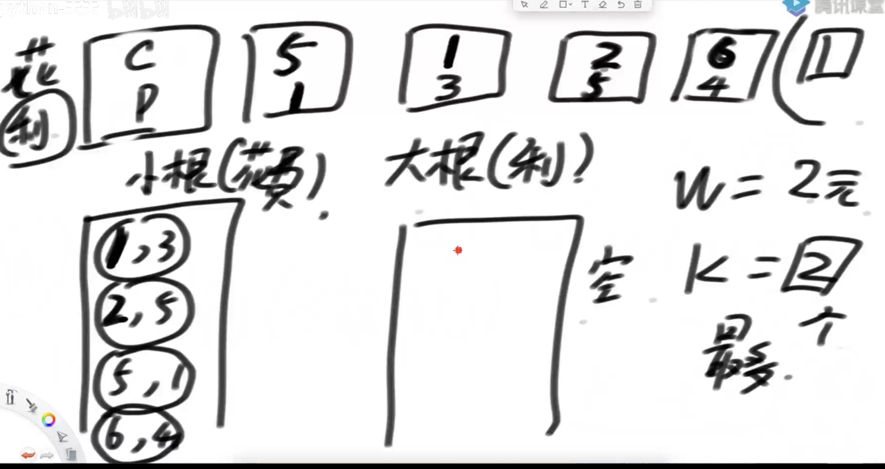

如果局部最优解可以得到全局最优解，那么贪心有效

如果局部最优解不能得到全局最优解，那么贪心无效

# 题目1


字典序

1. 两个字符串一样长，逐一比较每个字符
2. 不一样长，短的字符串后面补最低位的ASCII值（用最低值取代也行）

## 贪心策略

设a,b为一系列字符串里任意两个

1. 如果用 a>b 作为比较器，贪心失败	
2. 如果用 a+b>b+a(字符串拼接后比较) 作为比较器，贪心成功

## 如何判断提出的贪心策略是否正确？

提出的策略要判断是对的才能正确使用，那该怎么做呢？

### 方法1：严格的推导

为什么会这样？

因为比较器只能用在具有传递性的数据上。

​	传递性：1<2，2<3所以1<3.非传递性石头<布，布<剪刀，石头不小于剪刀

数字，浮点数等，之所以可以用比较器，是因为具有传递性。而没有传递性的数据使用比较器后，排序失败。

一堆数学证明后，证明a+b>b+a贪心成功，但这样子写，不是正常人能用的方法。证明过程太困难了，那怎么快速知道贪心是否成功的方法呢？

### 方法2：实践出结果

先用暴力方法（或其他成功的方法），解出这道题，再利用对数器，去判断贪心策略是否成功，如果失败就换一个。这就跳过复杂的证明过程，直接看结果是否对来得出贪心是否能用

## 贪心的特点

贪心算法内容一般都很简单，难点在于判断这个贪心是否有效，一般用对数器排序，或者堆就可以解了

一般面试少出现，因为区分度不够


# 题2

一些项目要占用一个会议室宣讲，会议室不能同时容纳两个项目的宣讲。给你每一个项目开始的时间和结束的时间
你来安排宣讲的日程，要求会议室进行的宣讲的场次最多。返回最多的宣讲场次。

## 暴力

递归，全排列

## 贪心

1. 比较器排序，结束时间最早的在前
2. 从排完序的数组里，依次取值

## 动态规划


# 题3：哈夫曼编码问题

给出一个整数数组，里面有任意多数字，把他们都加起来得到整数和sum，现在分割这个sum，直到分割出数组里的数字为止，没分割一次都会花费当前长度的代价，求代价之和最小的分割方法。

比如：{2，3，4}，sum=9，分割第一次：9=2+7 代价是9，分割第二次7=3+4，代价是7。现在分割了两次，总代价是9+7=16. 但这个不是最少的方法。

最好的方法：9=4+5（代价9），5=2+3（代价5），总代价14，这个才是最低的

## 贪心解法：

准备一个小根堆，把数字【2，1，7，3，4，2，1】放进去，如下图


之后从小根堆取出头两个数字1和1，把两个数字合成1+1=2得到2，更新总代价为0->2，并且把2放回去。

重复这个动作，直到小根堆里自剩下一个数字，这个数字就是数组数字之和，把拿出的数据排列成二叉树，如下图。


这个代价和就是最小的


## 暴力-递归

参数是数组总数，总代价，返回总代价

```java
	// 等待合并的数都在arr里，pre之前的合并行为产生了多少总代价
	// arr中只剩一个数字的时候，停止合并，返回最小的总代价
	public static int process(int[] arr, int pre) {
		if (arr.length == 1) {
			return pre;
		}
		int ans = Integer.MAX_VALUE;
		for (int i = 0; i < arr.length; i++) {
			for (int j = i + 1; j < arr.length; j++) {
				ans = Math.min(ans, process(copyAndMergeTwo(arr, i, j), pre + arr[i] + arr[j]));
			}
		}
		return ans;
	}
	//在arr里合并i,j两个数字，返回新数组
	public static int[] copyAndMergeTwo(int[] arr, int i, int j) {
		int[] ans = new int[arr.length - 1];
		int ansi = 0;
		for (int arri = 0; arri < arr.length; arri++) {
			if (arri != i && arri != j) {
				ans[ansi++] = arr[arri];
			}
		}
		ans[ansi] = arr[i] + arr[j];
		return ans;
	}
```


# 题4：

> 输入:正数数组costs、正数数组profits、正数K、正数M
>
> costs[i]表示i号项目的花费
> profits[i]表示i号项目在扣除花费之后还能挣到的钱(利润)
>
> K表示你只能串行的最多做k个项目
> M表示你初始的资金
> 说明:每做完一个项目，马上获得的收益，可以支持你去做下一个项目。不能并行的做项目。输出︰你最后获得的最大钱数。

## 贪心

创建一个小根堆和大根堆

小根堆花费小在上，大根堆利润大的在上，现在有2元，只能选择2个项目

​	

根据已有金钱2元，在小根堆里弹出符合条件的项目，（1,3）(2,5)放到大根堆，自动排序

然后选择大根堆堆顶项目为第一个项目，并且更新数据

金钱2元->7元，项目只能选1个，（2，5）消失，（1，3）还在大根堆不用移动。

重复这个过程，在小根堆把小于7元放入大根堆，之后弹出大根堆堆顶


# 题5：

给定一个字符串str，只由‘×’和‘.’两种字符构成。

‘×’表示墙，不能放灯，也不需要点亮
‘.’ 表示居民点，可以放灯，需要点亮
如果灯放在i位置，可以让i-1，i和i+1三个位置被点亮
返回如果点亮str中所有需要点亮的位置，至少需要几盏灯

解1：贪心，循环

不用递归，直接循环判断就可以了

解2：
