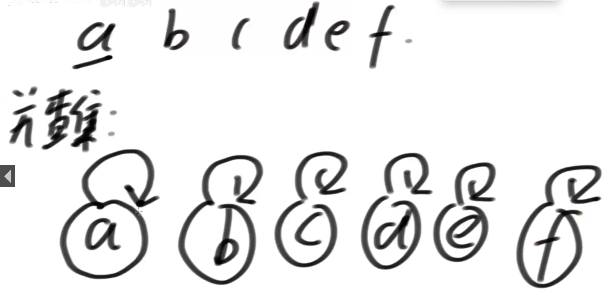

# 并查集

集合合并和查询

有一个集合数组

```
boolean isSameSet(a,e) 查询两个元素是否在同一个集合中。
void union(a,e) 把两个不相交的集合合并为一个集合。
```

要实现均摊时间复杂度O(1)

如下，有 a,b,c,d,e,f 六个集合，现在让集合指向自己



代表节点：在一个集合里，节点指针循环指向自己，这个节点就是集合的代表节点。

现在要合并a,e两个集合，首先用isSameSet(a,e)判断是不是同一个集合，因为a和e的代表节点为a和e（也就是他自己）不相同，可以得出两个集合不相交，所以可以执行合并操作。

让节点数小的集合的代表节点 指向 另一个集合的代表节点 即可。


好处在于，第二次合并的时候会检查是不是同一个集合，因为a和e的代表节点都是a，所以是同一个节点，也就会跳过合并步骤。

同理 合并e,c,因为e有两个节点，c有一个，所以c指向e的代表节点a上 

重要的2个优化：

1. 合并的时候，小集合指向大集合
2. 找代表节点的时候，把本节点的所有父节点都指向代表节点


# 题1[省份数量](https://leetcode.cn/problems/number-of-provinces/)

有 n 个城市，其中一些彼此相连，另一些没有相连。如果城市 a 与城市 b 直接相连，且城市 b 与城市 c 直接相连，那么城市 a 与城市 c 间接相连。

省份 是一组直接或间接相连的城市，组内不含其他没有相连的城市。

给你一个 n x n 的矩阵 isConnected ，其中 isConnected[i][j] = 1 表示第 i 个城市和第 j 个城市直接相连，而 isConnected[i][j] = 0 表示二者不直接相连，对角线一定是1，因为自己一定认识自己，矩阵一定以对角线对称，因为认识是相互的。

返回矩阵中 省份 的数量。


1. 只遍历右上半区

   

2. 用哈希表和数组的时间复杂度都是O(1)，但哈希表的常数项大，在大数据的情况下复杂度O(1)，但这里是小数据，用int[]来实现更好


# 题2：[200. 岛屿数量](https://leetcode.cn/problems/number-of-islands/)

给定一个二维数组matrix，里面的值不是1就是0，上、下、左、右相邻的1认为是一片岛，
返回matrix中岛的数量

## 解法1 递归，感染

主方法：从左到右，上到下，依次遍历，只有遇到‘1’字符才’感染‘成‘2‘并且岛数加一，感染的时候要调用感染方法

感染方法：迭代方法，让自己节点变成2后，要向上下左右迭代，注意 要先改成‘2’再迭代，不然会互相反弹

假如矩阵是m * n,时间复杂度 O(m * n)


## 解法2 并查集map实现

1. 初始化：每一个1都是一个集合，
2. 从头开始遍历，遇到1就和左边和上边合并，依次类推。在方法里，单独处理最上一行和最右一行，这样就不用写越界条件了
3. 最后判断有多少个集合即可


## 解法3  并查集 数组实现

矩阵数据转一维数组， 公式：i * 矩阵列数 + j=数组下标，数据量大的话数组会越界（可以用二维数组）。

3种的的复杂度都是O(1)，但常数项不同

# 题3 岛问题2

给出一个矩阵的长和宽，默认全部为0，这时候给一个二维数组，每次给矩阵的坐标让该坐标变1，并且计算岛数量，依次循环，每添加一个1，就计算一次岛数量


并查集解

时间复杂度O(m*n)初始化+O(k)每次加值

### 扩展

如果矩阵很大但每次加的值很少，该怎么优化


# 题4 岛问题3

给定一个二维数组matrix，里面的值不是1就是0，上、下、左、右相邻的1认为是一片岛，
返回matrix中岛的数量，如果matrix极大，设计一种可行的并行计算。

并行问题不会出现在算法题里，算法题一定是单cpu运行的

每一块里的每一个节点都要记录他的代表节点（最初感染点），之后合并区块时，相邻的节点把他们的代表节点也统一指向同一个节点，依次循环

