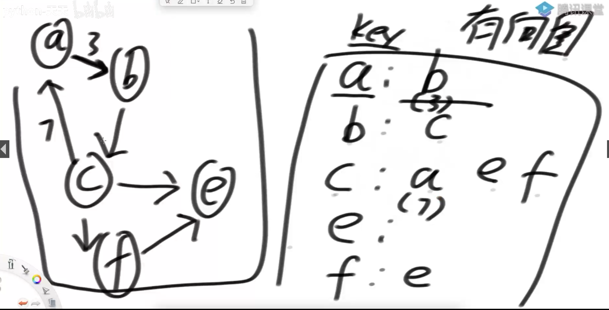
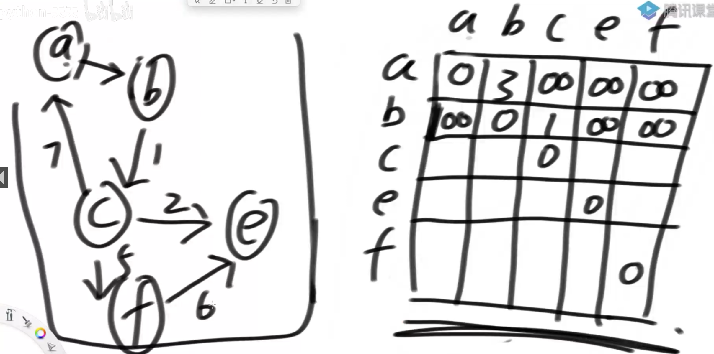
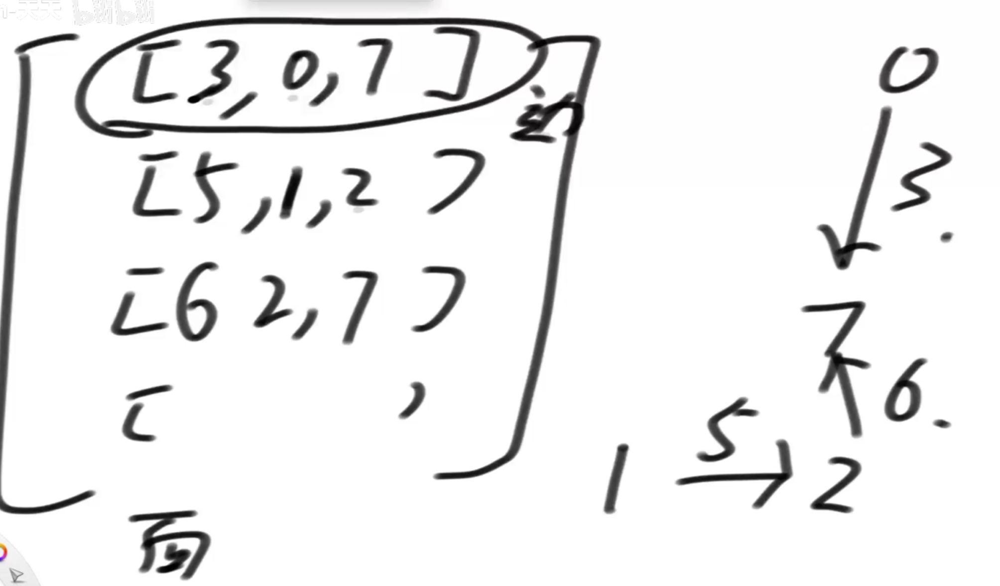
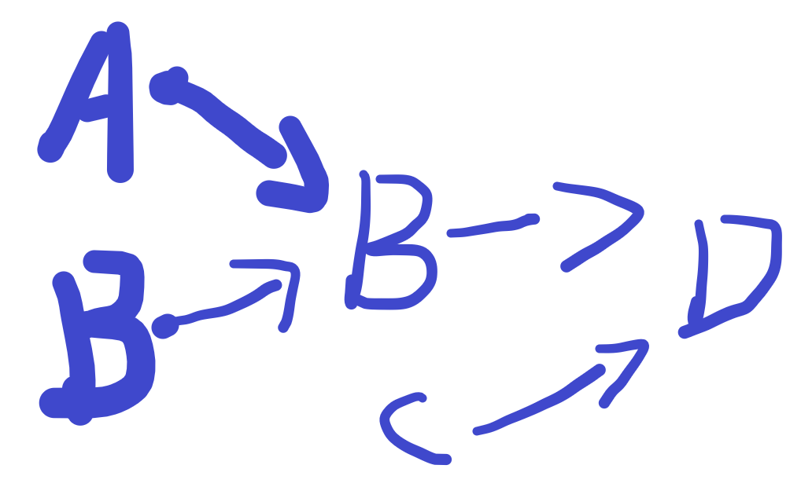
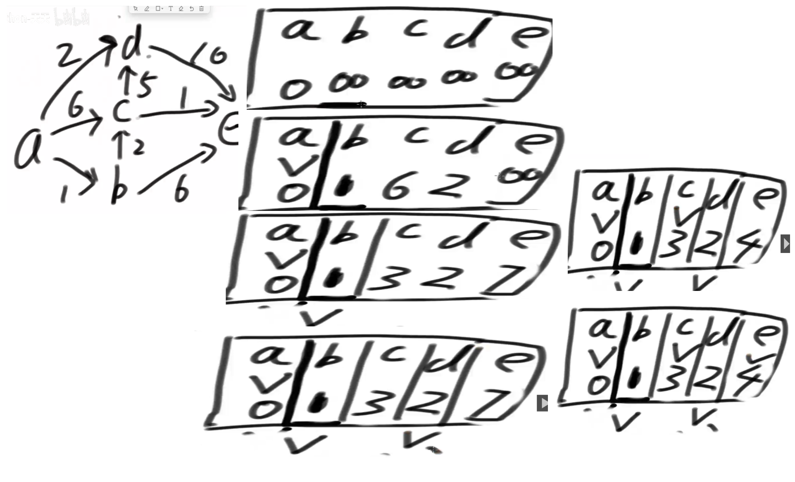

# 概念

有向图，无向图，有权图，无权图

入度：通向该节点的节点数量。出度：离开该节点的节点数量

所有图都用有向图来表示

## 表示图的数据结构

### 邻接表法

### 邻接矩阵法

无穷表示无法到达，符号自定义

### 表示方法1

给出一个二维矩阵，如上图【3,0,7】表示【边长，起点，终点】

### 总结

算法题/面试上，会给很多图结构，如果一个一个结构练，太花时间了，那么可以这样，写一个熟悉的图结构当适配器结构，以后都用这个结构来解题，那么，之后我们要做的就是把题目提供的结构转化成我们的适配器结构，再用熟悉的结构来解题就很快了

# 算法

## 宽度优先遍历，出队列打印

把开始节点放入栈中，开始循环，先出队，把指向的节点和记录表做判断，没有就打印，入队并记录，有则跳过
记录表：图里有可能有环结构，所以在遍历时，每出现过的节点都要记录

## 深度优先遍历，入栈打印

递归实现

空

迭代（循环）来实现

准备：记录表：记录已经经过的节点，栈，
把开始节点a打印，压栈并记录，开始迭代，a出栈后循环判断其下个节点b，并判断b有没有记录，如果没有就先把a压入，然后再把b压入，最后把b打印和记录，开始下一个循环

## 图的拓扑排序算法

目的是找到一个顺序，可以依次‘编译’所有节点，比如下图，如果要运行D必须先运行B和C，如果运行B那么一定先运行A和B。正确的运行顺序是，先AB后BC再D。
拓扑排序的目的就是找到这种执行‘顺序’

1)在图中找到所有入度为0的点输出
2)把所有入度为0的点在图中删掉，继续找入度为0的点输出，周而复始
3）图的所有点都被删除后，依次输出的顺序就是拓扑排序

要求∶有向图且其中没有环
应用︰事件安排、编译顺序

## 题目[127 · 拓扑排序 - LintCode](https://www.lintcode.com/problem/127/)

给定一个有向图，图节点的拓扑排序定义如下:

- 对于图中的每一条有向边 `A -> B` , 在拓扑排序中A一定在B之前.
- 拓扑排序中的第一个节点可以是图中的任何一个没有其他节点指向它的节点.

针对给定的有向图找到任意一种拓扑排序的顺序.

### 解法1 入度

1)在图中找到所有入度为0的点输出
2)把所有入度为0的点在图中删掉，继续找入度为0的点输出，周而复始
3）图的所有点都被删除后，依次输出的顺序就是拓扑排序

### 解法2 最大节点数/点次	

任意一个节点a,b，a可以达到的所有节点数记录为aSum，b为bSum，如果aSum>bSum ，那么a的拓扑排序会大于b
用经过点的次数 来代替 节点数也可以成功。

加上记录表，避免除非寻找点次（经过点的次数）值

### 解法3 最大深度

和解法2类似，不过是把点次改成了 最大子节点数+1

## 最小生成树算法之Kruskal

在一个图中，找到可以连通所有节点的最小权值 	 

1）总是从权值最小的边开始考虑，依次考察权值依次变大的边
2）当前的边要么进入最小生成树的集合，要么丢弃
3）如果当前的边进入最小生成树的集合中不会形成环，就要当前边
4）如果当前的边进入最小生成树的集合中会形成环，就不要当前边
5）考察完所有边之后，最小生成树的集合也得到了

### 并查集实现

1. 所有节点都是一个集合
2. 从最小权重的边开始，如果当前边的两个节点不是同一个集合，就要当前边
3. 直到所有边都遍历完

边多的时候较慢

## 最小生成树算法之Prim

1)可以从任意节点出发来寻找最小生成树
2)某个点加入到被选取的点中后，解锁这个点出发的所有新的边
3)在所有解锁的边中选最小的边，然后看看这个边会不会和已解锁节点形成环
4）如果会，不要当前边，继续考察剩下解锁的边中最小的边，重复3)
5）如果不会，要当前边，将该边的指向点加入到被选取的点中，重复2)
6)当所有点都被选取，最小生成树就得到了

节点多的时候慢

### 用堆实现

实现Dijkstra算法，用加强堆做更好的实现（16节+17节一开始）

注意：最小生成树里只能对无向图使用，用于有向图的话，因为起点不同可能会无法覆盖所有区域

## 最短路径算法-迪杰斯特拉

给出一个起始点，问这个起始点到任意点的最短路径，如果到达自己就是0，如果无法到达就是无穷

### 思路

1. 初始化：起始点a，到其他点的距离为无穷，到自己为0，记做结果表
2. 记录表，记录已经确定答案的点
3. 起始点a到相邻点的距离 与 结果表的值做对比，如果小于结果表那么就更新值，直到遍历所有相邻节点。
4. 然后把最小值当做确定值，放入记录表。在结果表里，选择除去确定值外的最小值，当做下一个点b
5. 假如a->b的最短距离为1，b的邻接节点是c，a->c = 6 > a->b->c =1+ 2=3就更新值为3，遍历完之后，选择最小值b作为确定值，再重复选择下一个最小值为下一个点

要求：不能有 负数环，也就是一个环中权值累加和是负数，不然最小值会更新下去

### 写法1

难点在于更新数据和找到最小数据时，时间花费过多，都要遍历一次全部节点

### 写法2

加强堆优化

