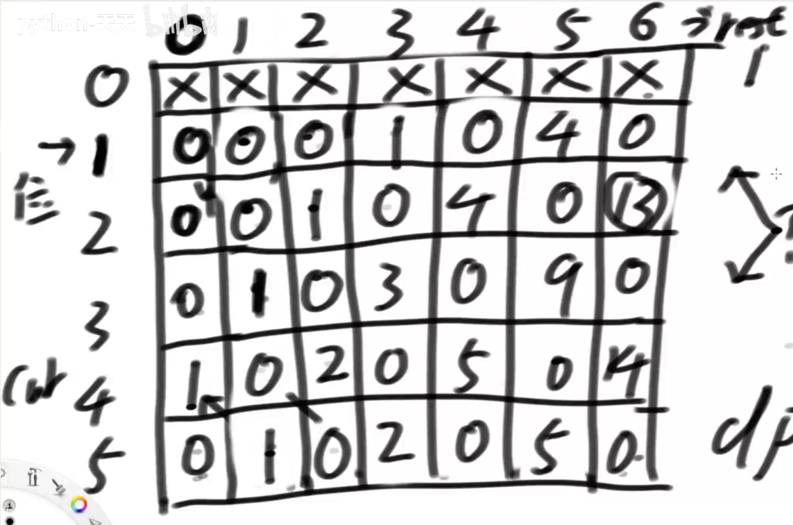
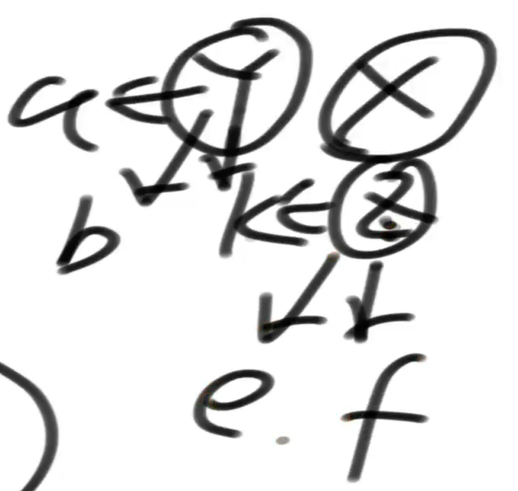
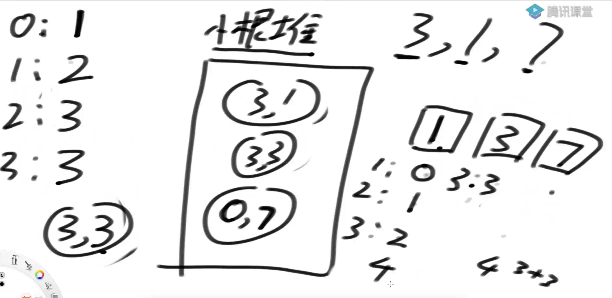
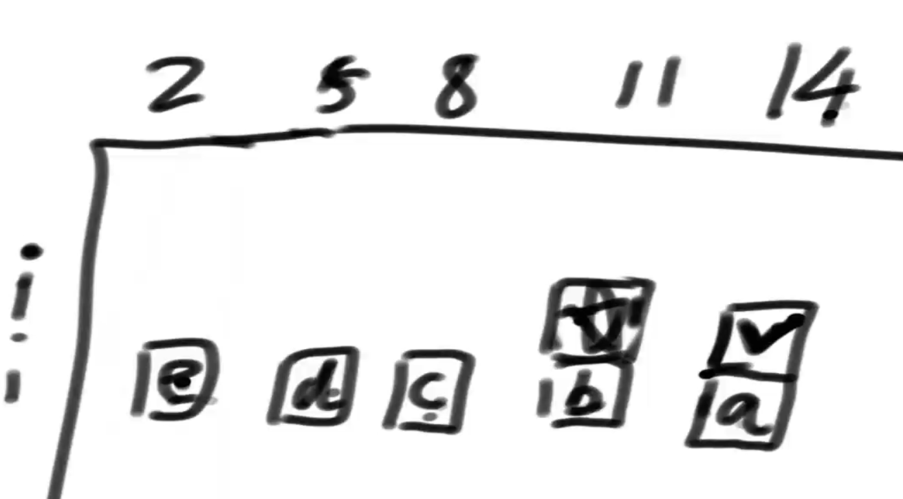
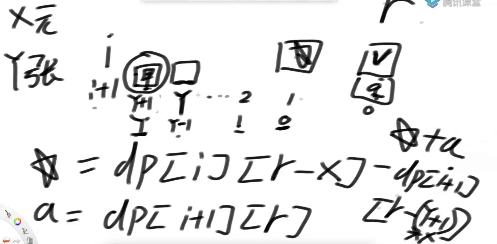
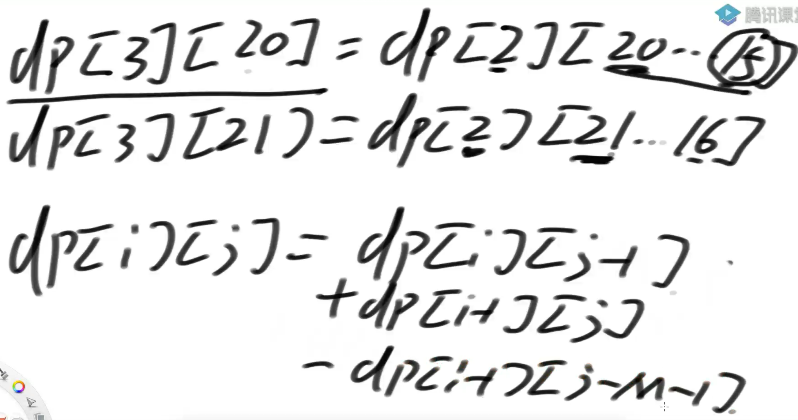
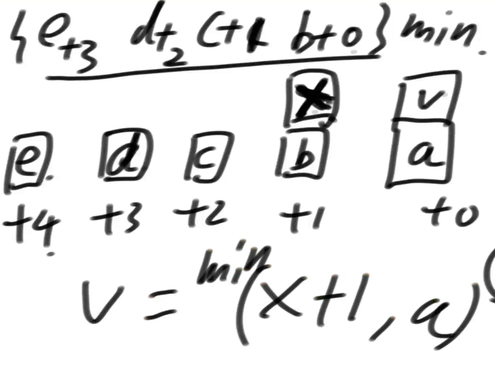
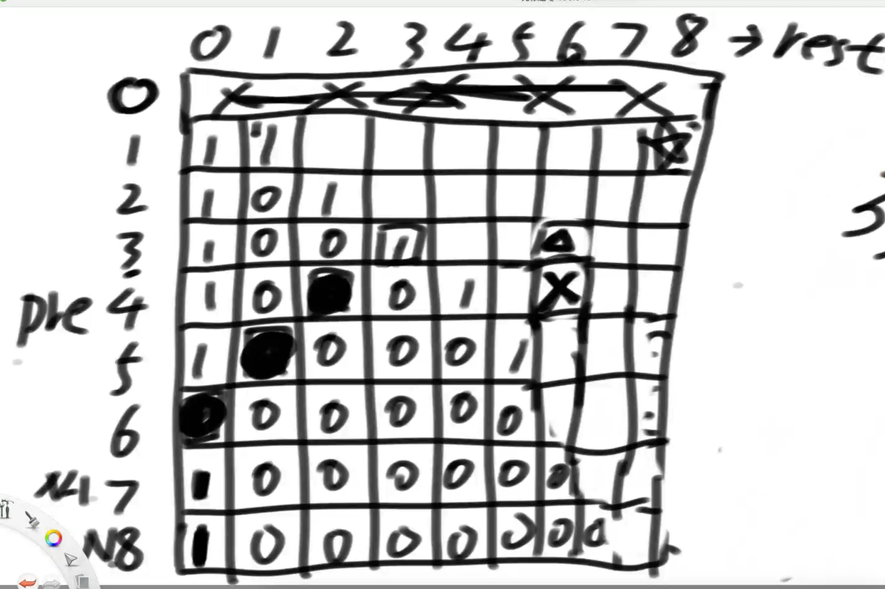

# 动态规划-总纲

代码在class18

动态规划会记住重复调用的过程，当你需要重新展现某些过程的时候，可以直接调出来使用

## 讲述暴力递归和动态规划的关系

递归过程会有大量重复过程，如果记住这些重复过程，然后再调用的时候复现，这种东西就叫做动态规划

分记忆化搜索/从顶向下的动态规划 和 动态规划（自下而上的）

## 记忆化搜索/从顶向下的动态规划

题1解2用的技巧名。动态规划是结果不是原因

动态规划都可以由暴力递归改进过来，但不是所有递归都可以改动态规划。

记忆化搜索也就是懒缓存，把重复值储存起来，避免重复计算，但顺序还是从顶向下的，简单来说就是带了缓存的暴力递归

## 动态规划模型

1. 从左到右，逐个尝试
2. 范围问题，重点在于开头和结尾：题目2
3. 样本对应模型，重点在于两个样本的结尾：题目6
4. 业务限制模型：生成数组时不明确变化范围：题9

数组里有些部分是不用处理的

## 记忆化搜索和动态规划_严格表结构

1. 暴力递归转动态规划时，发现依赖繁琐，那就不写动态规划，改写记忆化搜索
2. 如果一个值的依赖是有限的，没有for循环，那么两个的时间复杂度是一样的。相反出现for循环依赖，如果严格表结构把循环依赖优化掉，那就是严格表依赖快

# 题目1：

假设有排成一行的N个位置记为1~N，N一定大于或等于2
开始时机器人在其中的M位置上(M一定是1~N中的一个)
如果机器人来到1位置，那么下一步只能往右来到2位置；
如果机器人来到N位置，那么下一步只能往左来到N-1位置；
如果机器人来到中间位置，那么下一步可以往左走或者往右走；
规定机器人必须走K步，最终能来到P位置(P也是1~N中的一个)的方法有多少种
给定四个参数 N、M、K、P，返回方法数

## 解1

普通迭代，遍历所有走的路线，如果到达目的地就记录

## 解2

在解1的情况下增加了’缓存‘，免去重复计算，因为参数里的变量 剩余步数和当前位置 两个变量固定时，返回值一定固定，所以用这两个值，来当key，储存唯一的返回值即可

## 解3二维动态规划

纵坐标是当前位置，横坐标是剩余步数。
第1行只能依赖左下格的数据，第5行只能依赖右上格的数据，2~4行数据是左上+左下数据之和。
（4,0）是机器人要到达的地方，（2,6）是机器人在2位置，可以移动6步

# 题目2

给定一个整型数组arr，代表正数值不同的纸牌排成一条线
玩家A和玩家B依次拿走每张纸牌
规定玩家A先拿，玩家B后拿
但是每个玩家每次只能拿走最左或最右的纸牌
玩家A和玩家B都绝顶聪明
请返回最后获胜者的分数

## 解1 

两个迭代方法相互调用，

## 解2

先判断有没有重复过程，有再用 缓存 优化。

## 解3

动态规划，因为是两个迭代方法相互调用，所以也需要两个二维数组参与。
找规律然后写方法实现这个规律

# 第二部分

代码在class19

背包问题

记忆化搜索的一个很重要的注意点

通过面试题进一步强化动态规划的解题套路：从左往右尝试
暴力枚举每一种可能，在其中找到答案

## 题目3：背包问题

给定两个长度都为N的数组weights和values，weights[i]和values[i]分别代表 i号物品的重量和价值
给定一个正数bag，表示一个载重bag的袋子，装的物品不能超过这个重量
返回能装下的最大价值

### 解1：暴力递归

### 解2：动态规划

1. 从解1的参数中找到，’变量‘，根据变量找到每次迭代的相同过程
2. 举具体的例子，判断是否有重复过程，如果有就可以写动态规划
3. 根据解1的返回条件，作为变量数组的起始值
4. 根据解1的递归过程，判断数组从起始值开始的演算过程
5. 数组的某一个值就是答案

## 题目4：

规定1和A对应、2和B对应、3和C对应...26和Z对应
那么一个数字字符串比如"111”就可以转化为:
"AAA"、"KA"和"AK"
给定一个只有数字字符组成的字符串str，返回有多少种转化结果 

### 解1

只有一个变量，那就是 下标 ，这个参数的含义是：str[0..i-1]转化无需过问，str[i.....]去转化，返回有多少种转化方法。

返回值是小标到达临界值，返回1，表示当前组合确定成功了。返回0，表示当前组合失败，不成立。

组合的可能性有两种，1是选择当前下标转化，2是选择当前和下一个字符一起转化。

### 解2

因为只有一个可变参数，所以用一维数组即可。

把解1的代码做替换即可

## 题目5：

给定一个字符串str，给定一个字符串类型的数组arr，出现的字符都是小写英文
arr每一个字符串，代表一张贴纸，你可以把单个字符剪开使用，目的是拼出str来
返回需要至少多少张贴纸可以完成这个任务
例子：str= "babac"，arr = {"ba","c","abcd"}
ba + ba + c  3  。abcd + abcd 2 。 abcd+ba 2
所以返回2

### 解1递归

### 解2 递归优化

减枝。重复项是贴纸的出现次序，如题目的例子，ba + ba + c会出现几次，分别是ba + ba + c，ba + c + ba，c + ba + ba等，出现的顺序不一样但是内容都一样，所以这个要剪掉。

那么先减去str里先出现的字母，比如str= "babac"的b，因为"c"无法减去头字母所以跳过，依次类推，答案是不会变的，因为我们只是把 ba + ba + c，ba + c + ba，c + ba + ba，删除只出现ba + ba + c而已，答案是一样的。

难点在于如何快速遍历贴纸字符串里，是否有str头字母，可以把字符串数组转化成整数二维数组int [ stickers.length ] [26]，目的是快速查找符合要求的字母。

其余都类似解1

### 解3动态规划

字符串在递归的时候，会被贴纸删除几个字符串形成新的字符串，而这个新字符串会重复出现所以可以动态规划 ，但很难找到固定长度的结构来储存答案，那直接用容器就好了

字符串不同于数字，数字大部分可以用固定长度的数组解决，而类似字符串这种，	临界找不到或者很多，直接用容器傻缓存就好了

## 题目6：最长公共子序列长度

给定两个字符串str1和str2，
返回这两个字符串的最长公共子序列长度
比如 ： str1 = “a12b3c456d”,str2 = “1ef23ghi4j56k”
最长公共子序列是“123456”，所以返回长度6。

子序列是不连续的，子串是连续的

### 解1

多种可能

### 解2

根据方法里的递归函数，判断当前数依赖哪里，再把最初的依赖值初始化。

把解1 里的迭代方法，替换成数组的某个坐标

# 第三部分

代码在class20

## 题7：

给定一个字符串str，返回这个字符串的最长回文子序列长度
比如 ： str = “a12b3c43def2ghi1kpm”
最长回文子序列是“1234321”或者“123c321”，返回长度7

[516. 最长回文子序列 - 力扣（LeetCode）](https://leetcode.cn/problems/longest-palindromic-subsequence/)

### 解1 样本对应模型

已知一个字符串str1，准备str1的逆序字符串str2，str1和str2的 最大公共子序列长度 就是 最长回文子序列长度

### 解2 动态规划-范围模型

str[L...R].
可能性1：不以L开头，但以R结尾
可能性2：不以R开头，但以L结尾
可能性3：不以L开头，不以R结尾
可能性4：以L开头，以R结尾

### 解3：优化解2

常数级优化

当前值x依赖左边y，下边z，左下k，可知 x大于等于剩下的三个值，而左边y也是大于等于a,b,k，下边z也是大于等于k,e,f，那么x大于等于y和z 就等同于大于k，结论就是左下角的值可以去掉，也不影响结果。

## 题8：象棋-马

请同学们自行搜索或者想象一个象棋的棋盘，
然后把整个棋盘放入第一象限，棋盘的最左下角是(0,0)位置
那么整个棋盘就是横坐标上9条线、纵坐标上10条线的区域
给你三个 参数 x，y，k
返回“马”从(0,0)位置出发，必须走k步
最后落在(x,y)上的方法数有多少种? 

### 解1

时间复杂度O(8^k)，k是步数

越界返回，步数为0返回

八个方向，八个递归可能性，把八个值相加，返回出答案

### 解2

时间复杂度O(k)

3个变量，3维数组，可以发现，步数维 只依赖 步数-1维，而不依赖坐标。

## 题9：

给定一个数组arr，arr[i]代表第i号咖啡机泡一杯咖啡的时间
给定一个正数N，表示N个人等着咖啡机泡咖啡，每台咖啡机只能轮流泡咖啡
只有一台洗咖啡机，一次只能洗一个杯子，时间耗费a，洗完才能洗下一杯
每个咖啡杯也可以自己挥发干净，时间耗费b，咖啡杯可以并行挥发
假设所有人拿到咖啡之后立刻喝干净，
返回从开始等到所有咖啡机变干净的最短时间
三个参数：int[] arr、int N，int a、int b

### 解1

分两步完成。

第一步：N个人喝完咖啡的时间

小根堆 模拟小人在咖啡机前排队

第二步：根据喝完咖啡的时间，计算洗完咖啡杯的时间

可变参数，第几个人index，洗咖啡机可以使用的时间free。初始值是index=0，free=0

index越界后，返回0

可能性1：第index号人选择洗杯子，洗杯子的时间 和 后序所有人洗杯子的时间 的最大值 是当前答案

可能性2：第index号人选择不洗杯子，杯子自然风干的时间 和 后序所有人洗杯子的时间 的最大值 是当前答案

之后把两种可能的最小值输出就是答案

### 解2

洗咖啡机结束时间的最大值不好估计，那就考虑最差情况，当做最大范围。

注意有可能越界，当越界时，跳过本次处理，因为不可能比最差情况还差。

# 第四部分

代码在class21

为什么要从记忆化搜索优化成严格表结构

## 题10

给定一个二维数组matrix，一个人必须从左上角出发，最后到达右下角
沿途只可以向下或者向右走，沿途的数字都累加就是距离累加和
返回最小距离累加和

### 解1：动态规划

创建一个dp [ i ] [ j ] 二维表，表示从0,0到i,j的最短路径，每个位置只需要找到上面和右边的值就好了。

先创建第一行，再创建第一列，然后是第二行，第二列，以此类推，直到最后一个i,j得出结果

### 解2：优化1

把二维数组dp，变成两个一维数组a,b，a记录第一行的最小值，b记录第二行的最小值，然后a调用自己的数据和b的数据计算出第二行的最小值，以此类推，直到最值答案

### 解3：优化2

进一步优化，只用一个数组，先计算出第一行的最小值，再用这个数组计算出第二行，以此类推。

## 结论推广：严格表结构-空间压缩

### 结论1

如果出现二维数组的值，只依赖上边和左边，都可以用题10的结论

### 结论2

如果出现二维数组的值，只依赖上边和左上边，也只用一个数组即可

那么：

​	第一行，不用依赖任何东西就可以得出结果。在计算第二行值的时，用同一个数组，从后往前计算依赖关系并更新数据，可以得到第二行，以此类推

如果出现只依赖左边和左上边的，其实操作类似，只是方向不一样，把行改成列就好了

### 结论3

如果出现二维数组的值，只依赖上边、左边和左上，用一个数组arr[]和一个变量t 即可。

第一行只依赖左边,假如得出答案是 arr[]={a,b,c}; t 。

第二行更新的时候，用临时变量 t 记录值， t=arr[0] 也就是 t = a，然后arr[0]只依赖上边的arr[0]就可以更新出数据a1

现在arr[]={a1,b,c} t=a;

现在计算arr[1]，arr[1]依赖上边的arr[1]=b，左边的 t=a ,左上的arr[0]=a1，就可以更新出结果，后面的以此类推

### 结论4

一个二维数组 行N*列M，假如行N远小于列M，如果按行计算，空间耗费还是大。那可以转化思维，一列一列处理，思路是类似的

## 题11

arr是货币数组，其中的值都是正数。再给定一个正数aim。
每个值都认为是一张货币，
即便是值相同的货币也认为每一张都是不同的，
返回组成aim的方法数
例如：arr = {1,1,1}，aim = 2
第0个和第1个能组成2，第1个和第2个能组成2，第0个和第2个能组成2
一共就3种方法，所以返回3

### 解1 暴力递归

从左到右模型
可能性1：包含这张
可能性2：不包含这张

### 解2 动态规划

## 题12

arr是面值数组，其中的值都是正数且没有重复。再给定一个正数aim。
每个值都认为是一种面值，且认为张数是无限的。
返回组成aim的方法数
例如：arr = {1,2}，aim = 4
方法如下：1+1+1+1、1+1+2、2+2
一共就3种方法，所以返回3

### 解1：暴力递归-从左往右模型

循环，第i位0~N张，N=aim / arr[i]，剩下的aim给下一个递归

### 解2：严格表结构

和之前相比多了 for循环

### 解3：优化

画出矩阵图，分享任意一个位置的依赖情况，发现有优化的地方，如下。

星号原本依赖edcb，钩号原本依赖edcba ，通过观察可以发现，edcb被重复计算了，优化成 钩号 依赖 星号和a就可以了

## 题13

arr是货币数组，其中的值都是正数。再给定一个正数aim。
每个值都认为是一张货币，
认为值相同的货币没有任何不同，
返回组成aim的方法数
例如：arr = {1,2,1,1,2,1,2}，aim = 4
方法：1+1+1+1、1+1+2、2+2
一共就3种方法，所以返回3

### 解1：暴力递归和动态规划

统计面值的次词，用两个一维数组，一个储存面值大小，另一个储存面值数量。可以用HashMap去重统计

和题12类似，只不过变成有限张而已

### 解2：优化

优化部分和题12不一样，因为张数是有限的。

下图横坐标是i（第几张），纵坐标是r（还要满足的金额）

假设有现在有x元，y张，在钩位置开始计算，原本只要依赖 0~y即可，优化后可以直接依赖星星和a，但是星星比钩多了一个数据 甲 ，钩在计算的时候必须减去这个甲。结果计算是下面的 星星和a 的式子相加即可

特殊情况，如果有面额张数太多，在用完张数之前 r<0 了，就不用减甲

## 结论推广：严格表结构-枚举优化

如果 严格表结构中二维数组的任意值 要依赖多个值，以至于要使用 枚举来计算，就可以优化。类似题12和13.

变成只依赖，同层的相邻值+某值即可

## 题14

给定5个参数，N，M，row，col，k
表示在N*M的区域上，醉汉Bob初始在(row,col)位置
Bob一共要迈出k步，且每步都会等概率向上下左右四个方向走一个单位
任何时候Bob只要离开N*M的区域，就直接死亡
返回k步之后，Bob还在N*M的区域的概率

把每个方向都时一次，统计活下来的次数，再于总次数4^k相除

# 第五部分

代码在class22

## 斜率优化技巧

动态规划里，一个值出现枚举依赖， 通过复用临近值的方式减少重复依赖的情况

## 题15：杀手怪物

给定3个参数，N，M，K
怪兽有N滴血，等着英雄来砍自己
英雄每一次打击，都会让怪兽流失[0~M]的血量
到底流失多少？每一次在[0~M]上等概率的获得一个值
求K次打击之后，英雄把怪兽砍死的概率

### 解1暴力递归-样本对应模型

递归方法 返回怪兽死亡的次数，为了确保每次死亡都能计算上，结束条件一定是攻击次数为0	 

优化：如果血量小于零，可以用当前的剩余次数返回 (M+1)^K，达成另类的减枝

### 解2严格表结构

因为血量为负数也要继续计算，所以这里比较特别。

比如hp=3，砍4刀，伤害是0~5，那么剩余血量是 -2 ~ 3，其中-2~0是不能丢弃的，也要计算，又因为负数血量不管怎么砍都是负数血量，所以可以直接通过公式计算。(M+1)^(K-1)=（5+1）^3，M+1是因为包括0和M，K-1是因为要计算砍成负血后的次数。

### 解3严格表结构-迭代优化

i表示砍的次数，j表示剩余血量。

因为这一题特殊，即使血量小于0也要继续计算小于零的部分，所以在优化计算dp [ i ] [ j ] 的时候，上图的 -dp [ i-1 ] [ j-m-1 ] 是不能省略的，但这时候 j-m-1 < 0 会越界报错，那么就用公式算出来就好了，改成 ( j +1) ^ ( i -1)。

## 题16

arr是面值数组，其中的值都是正数且没有重复。再给定一个正数aim。
每个值都认为是一种面值，且认为张数是无限的。
返回组成aim的最少货币数（张数）

### 解1

存在每个面值都无法使用的情况。用最大值（或-1）表示不存在时返回的结果

### 解2

还是从左到右模型，单个面值的终止条件是现有金额小于0。

计算的时候 当前的面值张数 + 下一个面值的递归函数最小值

### 解3：优化

计算的时候不要忘记加张数。
上图中 最上面的min是叉的最小值计算，和 ‘钩’ 相比，每个值少了1，所以在计算的时候要加上1再比较，也就是上图中 最下面的式子

叉有可能是最大值，最大值+1会越界，所以记得先判断，再+1

## 题17：整数拆分问题

给定一个正数n，求n的裂开方法数，
规定：后面的数不能比前面的数小
比如4的裂开方法有：
1+1+1+1、1+1+2、1+3、2+2、4
5种，所以返回5

### 解1

循环递归，从0~n循环减去给的正数n，成功返回1

### 解2 动态规划

设pre是减去的数，rest是剩余数

pre=0废弃不用，rest=0的时候一定是1，
pre<rest 时是0，pre==rest时是1，剩余部分可以计算出来

### 解2 动态规划-优化

画图找依赖，然后找规律优化。

可知三角的依赖是正方形，叉依赖的是涂黑的部分，而第一个正方形是 dp [ pre ] [ rest-pre ]。显然可知优化公式

# 第六部分

内容：

以18节为总纲

通过面试题进一步强化动态规划的解题套路

位信息技巧

题目：

给定一个正数数组arr，
请把arr中所有的数分成两个集合，尽量让两个集合的累加和接近
返回最接近的情况下，较小集合的累加和

给定一个正数数组arr，请把arr中所有的数分成两个集合
如果arr长度为偶数，两个集合包含数的个数要一样多
如果arr长度为奇数，两个集合包含数的个数必须只差一个
请尽量让两个集合的累加和接近
返回最接近的情况下，较小集合的累加和

N皇后问题是指在N*N的棋盘上要摆N个皇后，
要求任何两个皇后不同行、不同列， 也不在同一条斜线上
给定一个整数n，返回n皇后的摆法有多少种。n=1，返回1
n=2或3，2皇后和3皇后问题无论怎么摆都不行，返回0
n=8，返回92

