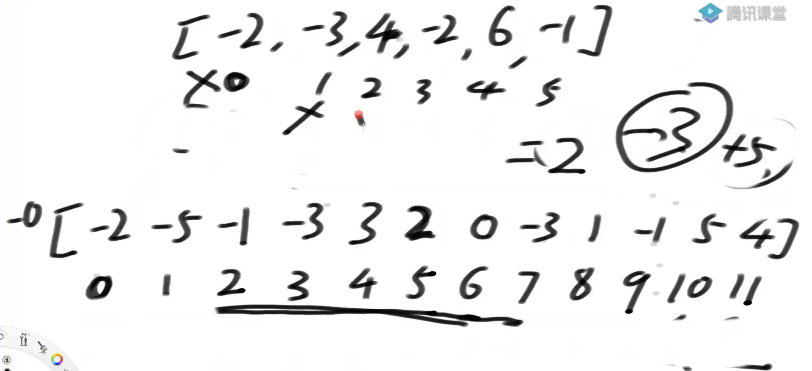

# 滑动窗口

代码在class24

## 定义

滑动窗口是一种想象出来的数据结构
滑动窗口有左边界L和有边界R
在数组或者字符串或者一个序列上，记为S，窗口就是S[L..R]这一部分
L往右滑意味着一个样本出了窗口，R往右滑意味着一个样本进了窗口
L和R都只能往右滑
L和R最多只能重叠，L不能越过R

# 窗口内最大值或最小值的更新结构

## 实现方法-双端队列

窗口内最大值：准备一个双端队列，规定队列是按照值从大到小排列，里面的值是数组下标
R向右移动时塞入新值a，如果队列右端值b大于a，那就把b弹出，直到a满足 严格的从大到小 ，如果全部弹出，那就自己压入，如果遇到相同值，同样把相同值弹出，再压入。这时候的双端队列，左边的第一值一定是当前窗口的最大值。

L向右移动，把L处的下标和队列左边比较，如果一样就弹出，否则不变

窗口内最小值：和上面的方法一样，不过要另外准备队列

时间复杂度是O(n)

# 题1 

窗口内最大值或最小值更新结构的实现
假设一个固定大小为W的窗口，依次划过arr，
返回每一次滑出状况的最大值
例如，arr = [4,3,5,4,3,3,6,7], W = 3
返回：[5,5,5,4,6,7]

# 题2

给定一个整型数组arr，和一个整数num
某个arr中的子数组sub，如果想达标，必须满足：sub中最大值 – sub中最小值 <= num，
返回arr中达标子数组的数量

## 解1 暴力枚举

复杂度O(n^3)

### 解2

复杂度O(n)

1. 如果在【L...R】范围，最大值max-最小值min<num,那么【L...R】中所有子数组都满足 小于num的情况
2. 如果在【L...R】范围，都不达标，那么L向左移或R向右移后，也无法达标

根据上面两个结论，可以得出
L和R从0开始循环，R先开始向右移动，如果符合条件就继续向右，直到不符合条件，那么符合条件的数量就是L~R个
然后L先右移动，继续循环	 	

# 题3

加油站的良好出发点问题
有两个数组,gas[]储存的油，cost[]表示到下一个加油站的距离，下标表示加油站。请找到所有能转一圈的加油站起始点

创建一个新数组arr1[ n ]，储存gas [ i ]-cost[ j ]的值.
创建一个新数组arr2[ 2 * n ]，储存 从下标0开始往后移动耗费的油量，从0 移到到n，再从n跳回0，重新0到n，一共2n长度。
因为要求可以绕一圈的加油站起始点，那么窗口长度一定是n，假设从下标2开始移动，那么移动后耗费的值等于arr2[2...7] - arr2[1] ,只要减之后的值中最小值是正数，说明这个起始点可以符合要求。

# 题4

动态规划中利用窗口内最大值或最小值更新结构做优化（难）
arr是货币数组，其中的值都是正数。再给定一个正数aim。
每个值都认为是一张货币，
返回组成aim的最少货币数
注意：因为是求最少货币数，所以每一张货币认为是相同或者不同就不重要了

## 解1左到右的暴力递归 

复杂度：O(货币数N*aim)

## 解2动态递归

复杂度：O(面值种数M*aim)

把arr数组去重后，形成新的两个数组，分别储存面值和对应的张数，方便后面计算

之前有类似的题，在找规律化简的时候，前面的是累加和，所以好算，而这里是要最小值，情况不一样了，没办法借助相邻值来节省计算。

可以用最小窗口来计算最小值，就不用一个个来判断了

