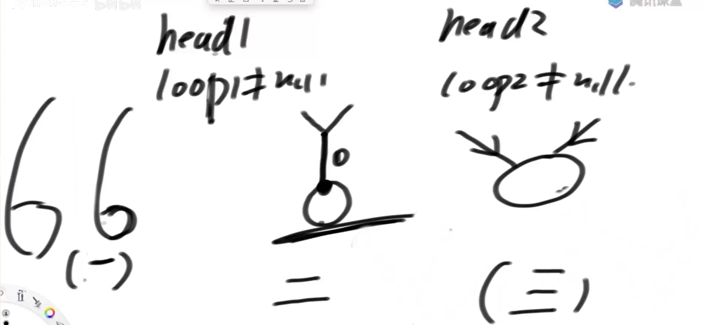

# 排序总结

## 归并，随机，堆的比较

归并稳定，快排最快（常数项低），堆最省空间

## 常见的坑

上面的算法改进，确实可以改进，可是改进后，其他的复杂度上升了。那干脆用其他算法不得了，没必要改进

这道题思路用快排，但是正常的快排写不出来，除非引用一篇特别难的论文，用里面的方法，并且把数据做限制，才写得出来。垃圾题...

## 工程上对排序的改进

1. 为了保证算法稳定
2. 数据小的时候，O(N^2)更快，之后数据变大了，O(N^2)才变慢

# 链表

链表上，难点在于，边界条件

## 小作业

用单链表（空间复杂度O（1））实现找节点，目的是锻炼边界条件

## 链表面试原则

在笔试时不在乎空间复杂度，可以用容器，只要尽可能快就可以了。

在面试时，不能用容器，但也要把时间复杂度放在第一位	

## 链表面试题1

1. 用容器
   1. 用栈。把链表全部导入栈里，栈取出数据的时候是链表的逆序，只要一一比较就好了
2. 不用容器
   1. 奇数链表。找到中点，让中点右边的链表指针逆序，并记录最右指针，让最右指针和最左指针遍历比较。最后恢复链表指针。
   2. 偶数链表。如下，找到上中节点或者下中节点，后半链表指针逆序，两端指针遍历比较，如果任意指针为null就结束比较，之后复原指针

## 实际面试原题

给一个链表 a1->a2->a3->b1->b2->b3 ,返回新链表  a1->b3->a2->b2->a3->b1

解法：用上面的方法

## 链表面试题2

### 面试解法

一共6个辅助节点，两两一组，这样可以保证稳定性，因为新节点是加在尾节点后的。但用3个头节点也行，就是没有稳定性（不能加在尾节点上，是加在头节点后）

## 链表面试题3

给一个链表，每一个节点有两个指针，n指针指向下一个节点，r指针指向任意节点（包括自己以及null）。返回拷贝新链表的头节点

### 用容器的解法

用map，k是旧节点，v是新节点。把旧节点指针r指向的值，通过map找到对应的新节点，再添加到新链表里就可以了

### 不用容器的解法

在原有的链表节点后拷贝新节点。两个指针指向头一对节点，比如1指向3，那么1`指向3``,同时两个指针同时前进2次

## 链表面试题4

### 1.判断链表是否是环，并且找到环的第一个入环节点

#### 用容器的解法

创建一个map容器，遍历链表插入map，把节点放入map前，先判断map里是否有该节点，如果没有就插入，否则该节点就是环的起始点，直到链表遍历完之后还没有找到 重复节点，说明该链表无环

#### 快慢指针

1. 快指针前进2步，慢指针前进1步，如果有环，一定相遇，但相遇的节点不一定是入环点。
2. 这时把快指针移动回头结点，慢指针原地不动。两个节点同时前进1步，当他们相遇的时候，相遇的节点就是入环节点（如果一开始就相遇，说明头结点就是入环点）

### 2.根据上面的方法得到两个链表入环情况

#### 1.两个无环链表

1. 如果两个有交点，那么两个链表的尾节点一点是一样的
2. 首先计算两个链表的长度，得出两链表的差值n,让长链表前进n步，这样两链表的剩余长度就相同了
3. 同时让他们前进一步，并且判断节点是否相等，如此循环判断，如果到最后都没有相同，说明两链表不相交，否则相交

#### 2.一环一无环

这种情况下，两个链表不可能有相交节点

#### 3.二个都有环

分有3种情况

1. 两个独立的环链表

2. 两个链表相交后，再进入了环（交点和入环点可以是同一个）

   ​	如果两个入环点相同，就是第二种情况，用上面‘两个无环链表’里的方法，以入环点为 链表的尾节点，找到链表交点

3. 两个链表从不同的地方进入环

​	让a入环点不动，b入环点前进，如果指针b遇到a说明是第3种情况，否则是第1种情况

### 链表面试题5

给一个函数Node n=f(head,node),输入链表的头结点和任意目标节点，要删除目标节点，并且返回头节点.

上面的题做变种，只提供链表的目标节点没有提供头节点，让你删除目标节点。

把目标节点的下一个节点的值，覆盖给目标节点，以此类推，再把最后一个节点删除。缺陷，无法删除最后一个节点。顾虑，这道题的思路难以运用在实际工作上，比如，a服务器->b服务器->c服务器，现在要删掉b服务器，很难把c服务器上的数据覆盖给b服务器，而且外部对c地址的调用会失效。
